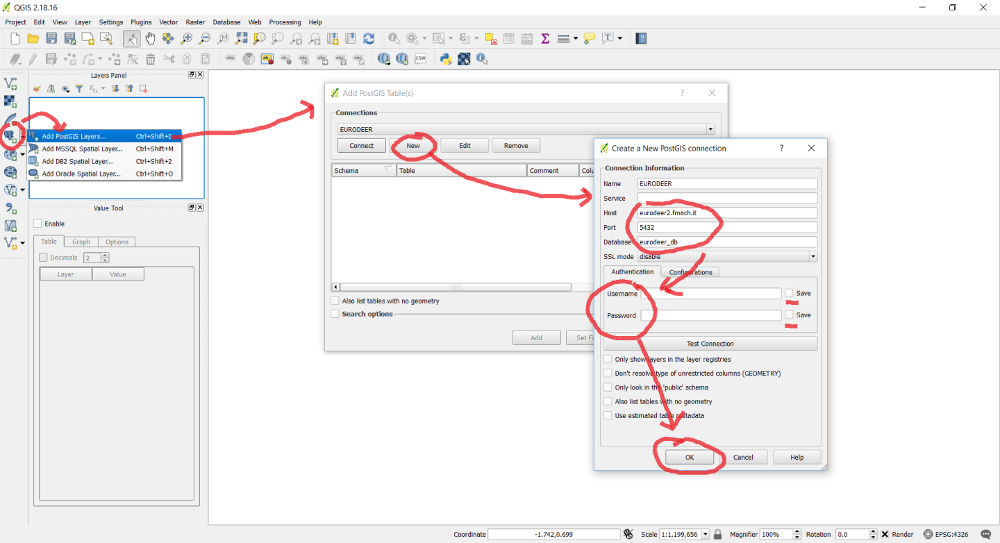
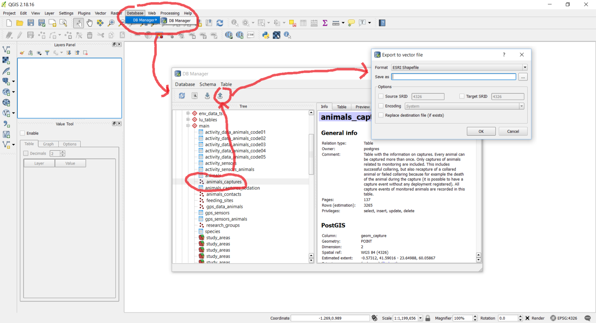

# 1. SQL and Spatial SQL

* [1.1  Introduction to SQL](#c_1.1)
* [1.2  Overview of the database used for the exercises](#c_1.2)
* [1.3  Schemas, tables, data types, primary key](#c_1.3)
* [1.4  SELECT, FROM, WHERE](#c_1.4)
* [1.5  AND, OR, IN, !=, NULL](#c_1.5)
* [1.6  ORDER BY, LIMIT,  DISTINCT, CASE, CAST, COALESCE](#c_1.6)
* [1.7  LIKE](#c_1.7)
* [1.8  GROUP BY (COUNT, SUM, MIN, MAX, AVG, STDDEV)](#c_1.8)
* [1.9  HAVING](#c_1.9)
* [1.10  Joining multiple tables](#c_1.10)
* [1.11  LEFT JOIN](#c_1.11)
* [1.12  Subqueries used in FROM statement](#c_1.12)
* [1.13  WINDOW functions](#c_1.13)
* [1.14  INSERT, UPDATE, DELETE](#c_1.14)
* [1.15  Temporal data (date, time, timezone), EXTRACT](#c_1.15)
* [1.16  Spatial objects in PostGIS](#c_1.16)
* [1.17  Create a point from coordinates](#c_1.17)
* [1.18  Reference systems and projections](#c_1.18)
* [1.19  Visualize spatial data in QGIS](#c_1.19)
* [1.20  Create a line from ordered points (trajectory)](#c_1.2)
* [1.21  Calculate distance between points and length of a trajectory](#c_1.21)
* [1.22  Create a polygon from points (convex hull)](#c_1.22)
* [1.23  Views](#c_1.23)

## <a name="c_1.1"></a>1.1 Introduction to SQL
The state-of-the-art technical tool for managing movement and population ecology data is the Spatial Relational DataBase Management Systems (*SRDBMS* for short). Using databases to manage data implies a considerable effort for those who are not already familiar with these tools, but this is necessary to be able to deal with large and/or complex data sets in a multi-user context where errors might be critical and data should be re-used for different projects. The time spent to learn databases will be largely paid back with the time saved for the management and processing of the data as compared with simpler data management approaches (e.g. spreadsheet). Other advanced data management systems exist (e.g. NoSQL database), but at the moment in most of the cases they are not the database technology of choice in ecology.

*SQL*, which stands for *Structured Query Language* is a way for interacting with SRDBMS. SQL statements are used to perform tasks such as update data on a database, create database objects or retrieve data from a database. In this lesson we will focus on data retrieval from an existing database. SQL is highly standardized and while each database platform has some kind of SQL dialect, it can be used with any SRDBMS tool (e.g. PostgreSQL [used during this course], MySQL, ORACLE, SQLServer, SQLite, SpatiaLite) with minimal changes. While complex queries can be hard to design, SQL itself is a simple language that combines a very limited sets of commands in a way that is similar to the natural language.

The reference software platform used in this lesson is the open source PostgreSQL RDBMS with its spatial extension PostGIS. The reference (graphical) interface used to deal with the database is **[pgAdmin3](http://www.pgadmin.org/)**. All the examples provided (SQL code) and technical solutions proposed are tuned on this software, although most of the code can be easily adapted for other platforms.

This lesson introduces students to SQL and spatial SQL and illustrates the main commands that are needed to interact with a database. Each command is described and an example shows how it works. At the end, an exercise is proposed to let students experiment by themselves.

Please note that in this lesson just some of the main SQL commands are discussed. If you want to explore more of the magic SQL world you can use one of the many tutorials available on the web. Among the others:

* [PostgreSQL official tutorial](https://www.postgresql.org/docs/current/static/tutorial.html)
* [postgresqltutorial](http://www.postgresqltutorial.com/)
* [w3resource](https://w3resource.com/PostgreSQL/tutorial.php)
* [sqlbolt](https://sqlbolt.com/)
* [webc
* heatsheet](http://webcheatsheet.com/sql/interactive_sql_tutorial/)
* [www.sql.org](www.sql.org)

## <a name="c_1.2"></a>1.2 Overview of the database used for the exercises
The database used in the example is a copy of what will be developed during lesson 2. It includes GPS tracking data from 5 roe deer in Italian Alps, with some information on individuals and captures. As a general reference, the database data model is illustrated below:

<p align="center">


The database is hosted on a server FEM. The IP address is: **eurodee2.fmach.it**, port: **5432**. The database is: **gps_tracking_db**. User name and password will be provided during the course. 

## <a name="c_1.3"></a>1.3 Schemas, tables, data types, primary key
The basic structure of a database is called a **[TABLE](https://www.postgresql.org/docs/devel/static/sql-createtable.html)**. As you would expect it is composed of columns and rows, but unlike what happens in Excel or Calc, you cannot put whatever you want in it. A table is declaratively created with a structure: each column has a defined **[DATA TYPE](http://www.postgresql.org/docs/devel/static/datatype.html)**, and the rows (also called *records*) must respect this type: the system enforces this constraint, and does not allow the wrong kind of data to slip in.  
Some of the frequently used data types are: `integer` for whole numbers, `numeric` for possibly fractional numbers, `text` for character strings, `date` for dates, `time` for time-of-day values, and `timestamp` for values containing both date and time. Each data type has specific properties and functions associated. For instance, a column declared to be of a numerical type will not accept arbitrary text strings, and the data stored in such a column can be used for mathematical computations. By contrast, a column declared to be of a character string type will accept almost any kind of data but it does not lend itself to mathematical calculations, although other operations such as string concatenation are available.   
The number and order of the columns is fixed, and each column has a name. The number of rows is variable — it reflects how much data is stored at a given moment.   
SQL does not make any guarantees about the order of the rows in a table. When a table is read, the rows will appear in an unspecified order, unless sorting is explicitly requested.  
You will see how to create a table in lesson 2, when you will create your own database.

Tables can be linked to one another (the jargon term for this kind of link is *relation*, which accounts for the *R* in *RDBMS*): you can explicitly ask that the value to put in a specific record column comes from another table. This helps reduce data replication, and explicitly keeps track of inter-table structure in a formalized way.

Each row of a table must be identified by the value of one. The same value (or set of values) cannot be repeated in two different rows. The attributes that identify a record are called **[PRIMARY KEY](https://www.postgresql.org/docs/devel/static/ddl-constraints.html#DDL-CONSTRAINTS-PRIMARY-KEYS)**. The primary key must be explicitly defined for all the tables (although this is not strictly required to create the table, it is necessary for a correct use of the database).

A database contains one or more **[SCHEMAS](http://www.postgresql.org/docs/devel/static/ddl-schemas.html)**, which in turn contain tables. Schemas also contain other kinds of objects, including data types, functions, and operators. The same object name can be used in different schemas without conflict. Schemas are analogous to directories at the operating system level, except that schemas cannot be nested.  
Schema are used:

* to allow many users to use one database without interfering with each other
* to organize database objects into logical groups to make them more manageable
* third-party applications can be put into separate schemas so they do not collide with the names of other objects

You can run SQL commands, explore database object and see table content using the graphical interface **[PgAdmin](https://www.pgadmin.org/)** version 3 or version 4. Even if version 4 is more advanced, it lacks some useful features that are present in version 3.

## <a name="c_1.4"></a>1.4 SELECT, FROM, WHERE
The operation of choosing the records you want is called *selection*: the `SELECT` command allows you to express clearly which columns you need, which rows, and in which
order; you can also generate computed data on the fly. The basic structure of a `SELECT` command is the following:

```sql
SELECT
   <one or more columns, or * for all>
FROM
   <one or more tables>
WHERE
   <conditions to filter retrieved records on>
;
```

SQL is case insensitive. SQL statements can be long and span over multiple lines; to signal to the database server the they are complete and should be executed, you have to terminate them with a semicolon `;`.

`SELECT` command can be used without any other commands. Here some examples.

```sql
SELECT 1+1;
```

```sql
SELECT 'Hi there';
```

```sql
SELECT now();
```

`FROM` command specifies the tables where is stored the required information. If a table is specified, after `SELECT` you must list the columns of the table that you want to retrieve. If you use `*`, all the columns are returned.

```sql
SELECT 
  animals_id, 
  animals_code, 
  name
FROM 
  main.animals;
```

```sql
SELECT 
  *
FROM 
  main.animals;
```

`WHERE` is used to set criteria on the data that you want to retrieve.

[example with 1 criteria on number and 1 criteria on string]
```sql
SELECT 
  *
FROM 
  main.animals
WHERE
  sex = 'f';
```

```sql
SELECT 
  *
FROM 
  main.animals
WHERE
  animals_id = 1;
```
You can use `AS` to specify an alias for columns (and also tables).

```sql
SELECT 
  animals_id AS id, 
  animals_code AS CODE
FROM 
  main.animals;
```

The complete reference of the `SELECT` statement and related commands is available
[here](https://www.postgresql.org/docs/devel/static/sql-select.html).

## <a name="c_1.5"></a>1.5 AND, OR, NOT, IN, <, >, =, !=, NULL
In `WHERE` statements you can include the classic logical operations to combine the different conditions (`AND`, `OR`, `NOT`).  
Conditions can be expressed using the standard symbols (`>`, `<`, `=`, `!=`). If the equivalence is set to a number of values, you can use `IN` followed by the list of values in parenthesis.  
When no information is available in a column (which is different from FALSE or 0!), you have to use the key term `NULL` and the conditions `IS NULL`, `IS NOT NULL`.  
Here below you can find some examples.

```sql
SELECT 
  gps_data_animals_id, 
  animals_id, 
  acquisition_time, 
  longitude, 
  latitude,  
  roads_dist
FROM 
  main.gps_data_animals 
WHERE
  animals_id = 1 AND 
  roads_dist = 100;
```

```sql
SELECT 
  *
FROM 
  main.animals
WHERE
  animals_id <= 2 OR
  sex = 'f';
```

```sql
SELECT 
  gps_data_animals_id, 
  animals_id, 
  acquisition_time, 
  longitude, 
  latitude,  
  roads_dist
FROM 
  main.gps_data_animals 
WHERE
  animals_id in (1, 4) AND 
  longitude IS NULL AND 
  acquisition_time <= '2005-11-19 12:00:00+00';
```

## <a name="c_1.6"></a>ORDER BY, LIMIT,  DISTINCT, CASE, CAST, COALESCE
You can control how records are visualized. Particularly, you can define the criteria to order them using `ORDER BY (column a) ASC/DESC, (column b) ASC/DESC ...` (ASC is used by default).  
With `LIMIT` you can retrieve just a defined number of records, which is convenient when tables have many record.  
For example you can combine ORDER BY and LIMIT to get the first 10 locations of a given animal. 

```sql
SELECT 
  gps_data_animals_id, 
  animals_id, 
  acquisition_time, 
  longitude, 
  latitude
FROM 
  main.gps_data_animals 
WHERE
  animals_id = 1 
ORDER BY acquisition_time 
LIMIT 10;
```

Sometimes we are only interested in which values do appear, and not on
specific records. In this case you can `DISTINCT` to squash duplicate values.

```sql
SELECT DISTINCT 
  animals_id 
FROM 
  main.animals;
```
The SQL `CASE` expression is a generic conditional expression, similar to if/else statements in other programming languages. The syntax is `CASE WHEN criteria THEN value END`. Here an example

```sql
SELECT 
  gps_data_animals_id, 
  animals_id, 
  acquisition_time, 
  longitude, 
  latitude,
  roads_dist,
  CASE WHEN roads_dist < 1000 THEN 'close' ELSE 'far' END AS distance
FROM 
  main.gps_data_animals 
WHERE
  animals_id = 1 AND
  roads_dist IS NOT NULL
LIMIT 100;
```
There are many cases that you want to convert one data type into another. PostgreSQL provides the syntax for converting one type into another. The easiest way is to use `::` followed by the new data type. Note that not all the conversions are allowed. A text cannot be cast as number, but numbers can be transformed into text, or a decimal number into an integer.


```sql
SELECT 
  7 AS example1a,
  7::text AS example1b,
  7.8::integer AS example2,
  now() AS example3a,
  now()::text AS example3b,
  10/3 AS example4a,
  10/3.0 AS example4b;
```
The `COALESCE` function returns the first of its arguments that is not null. Null is returned only if all arguments are null. It is often used to substitute a default value for null values when data is retrieved for display.

```sql
SELECT 
  gps_data_animals_id, 
  animals_id, 
  acquisition_time, 
  coalesce(longitude, 0) AS longitude_with_0, 
  coalesce(latitude, 0) AS latitude_with_0
FROM 
  main.gps_data_animals 
LIMIT 100;
```

##### EXERCISE
* Visualize the first 10 records in the *main.gps_data_animals* table that belong to animal_id 1 and where the distance to road is > 3000 meters
* Visualize the records in the *main.animals* table with a fields with "male" or "female" according to their sex
* Visualize all the existing values for the column *pro_com* in the *main.gps_data_animals* table

## <a name="c_1.7"></a>1.7 LIKE
PostreSQL provides many tools to deal with string object. The most notable is **[LIKE](https://www.postgresql.org/docs/devel/static/functions-matching.html)**. The LIKE expression returns true if the string matches the supplied pattern. If pattern does not contain percent signs or underscores, then the pattern only represents the string itself; in that case LIKE acts like the equals operator. An underscore ( `_` ) in pattern stands for (matches) any single character; a percent sign ( `%` ) matches any sequence of zero or more characters.

Some examples are reported below.

```sql
SELECT 
  pro_com, 
  nome_com
FROM 
  env_data.adm_boundaries;
```

```sql
SELECT 
  pro_com, 
  nome_com
FROM 
  env_data.adm_boundaries
WHERE
nome_com like 'C%';
```

```sql
SELECT 
  pro_com, 
  nome_com
FROM 
  env_data.adm_boundaries
WHERE
nome_com like 'C%e';
```

```sql
SELECT 
  pro_com, 
  nome_com
FROM 
  env_data.adm_boundaries
WHERE
nome_com like 'C____e';
```

##### EXERCISE
* Retrieve all the animals that have the letter 'a' in their name

## <a name="c_1.8"></a>1.8 GROUP BY (COUNT, SUM, MIN, MAX, AVG, STDDEV)
The `GROUP BY` clause divides the rows returned from the `SELECT` statement into groups. For each group, you can apply an aggregate function to the values of the columns that are nto used as criteria to group the rows. The main aggregate functions (at least for numbers) are `COUNT`, `SUM`, `MIN`, `MAX`, `AVG`, `STDDEV`. For example SUM calculates the sum of items and COUNT gets the number of items in the groups.

The GROUP BY clause must appear right after the FROM or WHERE clause. Followed by the GROUP BY clause is one column or a list of comma-separated columns. You can also put an expression in the GROUP BY clause.

```sql
SELECT column_x, aggregate_function(column_y)
FROM table_x
GROUP BY column_x;
```

The following statement illustrates the syntax of the GROUP BY clause.
```sql
SELECT 
  sex, 
  count(animals_id) as number_animals 
FROM 
  main.animals
GROUP BY 
  sex;
```

```sql
SELECT 
  gps_sensors_id, 
  max(roads_dist)
FROM 
  main.gps_data_animals
GROUP BY 
  gps_sensors_id;
```

##### EXERCISE

* Count how many records you have per animal with coordinates not null (table *main.gps_data_animals*) and the average altitude.

## <a name="c_1.9"></a>1.9 HAVING
We often use the `HAVING` clause in conjunction with the `GROUP BY` clause to filter group rows that do not satisfy a specified condition. The `HAVING` clause sets the condition for group rows created by the `GROUP BY` clause after the GROUP BY clause applies while the `WHERE` clause sets the condition for individual rows before `GROUP BY` clause applies. This is the main difference between the `HAVING` and `WHERE` clauses, as illustrated in the examples.

```sql
SELECT 
  animals_id, 
  count(animals_id), 
  avg(roads_dist)
FROM 
  main.gps_data_animals
WHERE 
  roads_dist < 900
GROUP BY 
  animals_id
ORDER BY 
  animals_id;
```

```sql
SELECT 
  animals_id, 
  count(animals_id),
  avg(roads_dist)::integer
FROM 
  main.gps_data_animals
GROUP BY 
  animals_id
HAVING
  avg(roads_dist) < 900
ORDER BY 
  animals_id;
```

##### EXERCISE

* Count how many records you have per station_id (table *main.gps_data_animals*) considering animals 1 and 2.
* Visualize all the animals that have more than 2500 records (table *main.gps_data_animals*) 

## <a name="c_1.10"></a>1.10 Joining multiple tables
Thus far, our queries have only accessed one table at a time. Queries can access multiple tables at once, involving information for all the tables involved. A query that accesses multiple rows of the same or different tables at one time is called a **join query**. There are different syntax that can be used. The simpler one is illustrated in the next exaple. If I want to visualize all the records in the table *main.gps_data_animals* that belongs to male animals, I have to include all the information in the table *main.animals* where the sex is stored and then I have select the pairs of rows where these animals_id (that is present in both tables and "link" them) match.

```sql
SELECT 
  animals.animals_id, 
  animals.sex, 
  gps_data_animals.acquisition_time, 
  gps_data_animals.longitude, 
  gps_data_animals.latitude
FROM 
  main.gps_data_animals, 
  main.animals
WHERE 
  animals.animals_id = gps_data_animals.animals_id;
```

When multiple tables are involved, it is a good practice to qualify the name of each column with the name of the table it belongs to. This is compulsory if the same name of column is used in two different tables.

The join illustrated in the example can also be written in this alternative and equivalent form:
```sql
SELECT 
  animals.animals_id, 
  animals.sex, 
  gps_data_animals.acquisition_time, 
  gps_data_animals.longitude, 
  gps_data_animals.latitude
FROM 
  main.gps_data_animals
INNER JOIN 
  main.animals
ON (animals.animals_id = gps_data_animals.animals_id);
```

##### EXERCISE
* Retrieve the name of each animal with the timestamp of its first and last location

## <a name="c_1.11"></a>1.11 LEFT JOIN
In the previous examplse, only the records from the first and from the second table that match the join conditions are included in the results. Using `JOIN` syntax is possible to include ALL record from the first table and only the records from the second table that match the join conditions. This is achieved with the use of `LEFT JOIN`. This kind of join is useful in many situations.

```sql
SELECT 
  lu_age_class.age_class_code, 
  lu_age_class.age_class_description, 
  animals.name, 
  animals.sex
FROM 
  lu_tables.lu_age_class
LEFT JOIN
  main.animals
ON 
  lu_age_class.age_class_code = animals.age_class_code;
```

In this case, also the age class code with no animals associated are reported.

##### EXERCISE
* Count how many animals are included in the table *main.animals* for each species listed in the table *lu_tables.lu_species* (report '0' instead of *NULL* if there are no animals for that species).

## <a name="c_1.12"></a>1.12 Subqueries used in FROM statement
In the `FROM` you can you not only tables, but also the result of another `SELECT`, as far as it is in parenthesis and that an alias is provided. The result of the sub-query will be traten by PostgreSQL as a table. Here an example.

```sql
SELECT 
  count(dist_animal.animals_id)::integer AS num_individuals,
  avg(dist_animal.avg_dist_animal)::integer AS avg_distance_individual,
  stddev(dist_animal.avg_dist_animal)::integer AS stddev_distance_individual,
  min(dist_animal.avg_dist_animal)::integer AS min_distance_individual, 
  max(dist_animal.avg_dist_animal)::integer AS max_distance_individual 
   
FROM
	(SELECT animals_id, avg(roads_dist) avg_dist_animal
	FROM main.gps_data_animals
	GROUP BY animals_id) AS dist_animal 
;
```

##### EXERCISE
* Retrive the animal with the largest altitudinal range


## <a name="c_1.13"></a>1.13 WINDOW functions

A window function performs a calculation across a set of rows that are somehow related to the current row. This is similar to an aggregate function, but unlike regular aggregate functions, window functions do not group rows into a single output row, hence they are still able to access more than just the current row of the query result. In particular, it enables you to access previous and next rows (according to a user-defined ordering criteria) while calculating values for the current row. This is very useful, as a tracking data set has a predetermined temporal order, where many properties (e.g. geometric parameters of the trajectory, such as turning angle and speed) involve a sequence of GPS positions. It is important to remember that the order of records in a database is irrelevant. The ordering criteria must be set in the query that retrieves data.  
Once the window function is defined (e.g. `AVG`, `ROW_NUMBER()`,`LAG` *[value evaluated at the row that is offset rows before the current row within the partition]*), the user as to define the partition (grouping) criteria and the ordering with this syntax `OVER (PARTITION BY ... ORDER BY ...)`.

In this example, you calculate the difference between the distance to roads of each location and the average distance to roads for all the location of the same animal.

```sql
SELECT 
  animals_id, 
  acquisition_time, 
  roads_dist,
  AVG(roads_dist) OVER (PARTITION BY animals_id) avg_road_distance,
  (roads_dist - AVG(roads_dist) OVER (PARTITION BY animals_id))::integer diff_avg_road_distance
FROM 
  main.gps_data_animals
WHERE 
  roads_dist is not null
LIMIT 100;
```

In this example you visualize the acquisition time of all records of animal 1 together with the acquisition time of the previous record (and their difference). In this case you have to specify the order of records inside each partition.

```sql
SELECT 
  animals_id, 
  acquisition_time,
  lag(acquisition_time, 1) OVER (PARTITION BY animals_id order by acquisition_time) AS acquisition_time_previous,
  acquisition_time - lag(acquisition_time, 1) OVER (PARTITION BY animals_id order by acquisition_time) AS diff_time
FROM 
  main.gps_data_animals
WHERE 
  roads_dist is not null
ORDER BY animals_id, acquisition_time  
LIMIT 100;
```

##### EXERCISE
* Calculate the time difference between all the locations and the first location of each animal
* Calculate the distance between a location and the previous location
* Calculate the total number of valid locations (gps_validity_code = 1) for each animal and the percentage  over the total number of records


## <a name="c_1.14"></a>1.14 INSERT, UPDATE, DELETE

With SQL you can do more that query data. Particularly, you can modify data using mainly these three statements: `INSERT`, `UPDATE`, `DELETE`.  
Syntax is pretty simple, let's see a few examples. Here we insert a new animal in *main.animals* table:

```sql
INSERT INTO main.animals (animals_id,animals_code,name,sex) VALUES (99,'NEW01','new','f');
```

Check what's happened:

```sql
SELECT * FROM main.animals WHERE animals_id=99;
```

We forgot to define *age_class_code* and *species_code*, so let's add them to our new record:

```sql
UPDATE main.animals
SET age_class_code = 1, species_code = 3
WHERE animals_id = 99;
```

Pay attention to `UPDATE` statements: if you forget the `WHERE` part, they apply to the whole table - in the present case clearly not what we want.

```sql
SELECT * FROM main.animals WHERE animals_id=99;
```

To get rid of the test record we just added:

```sql
DELETE FROM main.animals WHERE animals_id=99;
```

Here too you need to remember the `WHERE` clause: otherwise all of your records will be deleted!

## <a name="c_1.15"></a>1.15 Temporal data (date, time, timezone), EXTRACT

PostgreSQL (and most of the database systems) can deal with a large set of specific type of data with dedicated database data types and related functionalities in addition to string and numbers. For wildlife tracking data, time and space are key information. Here we introduce a new data type to deal with temporal reference: **[timestamp with time zone](http://www.postgresql.org/docs/devel/static/datatype-datetime.html)**, i.e. date + time + time zone together. In particular, in PostgreSQL you have the following data types:
* Timestamp 
* Timestamp with time zone
* Date
* Time
* Time with time zone
* Interval

Timestamp join date and time of the day, which is needed to identify a specific moment in time. In addition, the same moment can be expressed in different way according to the country in the world where you are. In fact, to unambiguously identify a moment in time you must specify the time zone. This has analogy with spatial reference system for spatial objects. In general, `Timestamp with time zone` is the correct way to express a moment in time because it is an "absolute" reference.
Keep in mind that: 
> "for timestamp with time zone, the internally stored value is always in UTC (Universal Coordinated Time, traditionally known as Greenwich Mean Time, GMT). An input value that has an explicit time zone specified is converted to UTC using the appropriate offset for that time zone. If no time zone is stated in the input string, then it is assumed to be in the time zone indicated by the system’s TimeZone parameter, and is converted to UTC using the offset for the timezone zone. [...]"
 
and

> "PostgreSQL doesn’t store the time zone they come from with your timestamp. Instead it converts to and from the input and output timezone."

When you retrieve the data you specify the timezone you want to be visualized (server timezone by default). If you want to see the default server timezone run this query:

```sql
SHOW timezone;
```

Here some example of the different behaviour of timestamp with or without timezone:

```sql
SELECT
  now() now_here,
  now() AT TIME ZONE 'America/Los_Angeles' now_in_la,
  '2018-06-17 10:00:00'::timestamp no_tz,
  '2018-06-17 10:00:00'::timestamp with time zone tz_no_specified,
  '2018-06-17 10:00:00+02'::timestamp with time zone AS tz_specified,
  now()::date AS date,
  now()::time AS time;
```

PostgreSQL implements an interval data type along with the time, date and timestamp with timezone data types. An interval describes a duration, like a month or two weeks, or even a millisecond:

```sql
SELECT 
  interval '1 month' example1,
  interval '2 weeks' example2,
  2 * interval '1 week' example3,
  78389 * interval '1 ms' example4,
  now()-'2018-05-17 10:00:00+00'::timestamp with time zone example_diff;
```

You can use intervals to add or subtract time to a timestamp:

```sql
SELECT 
  now(),
  now() + interval '1 hour' example_operation;
```

You can extract specific elements of a timestamp (e.g. months, year, minute). In particular, `epoch` is very useful as it transform a date in seconds from a specific moment in time. Doing so, you can deal with time reference as integer.

```sql
SELECT 
  now(),
  extract (year from now()) as year,
  extract (month from now()) as month,
  extract (doy from now()) as doy,
  extract (epoch from now()) as epoch,
  extract (epoch from now()) - extract (epoch from (now() - interval '1 minute')) difference_seconds;
```

Many more tools to manage time are described in the **[PostgreSQL documentation](https://www.postgresql.org/docs/devel/static/functions-datetime.html)**.

##### EXERCISE
* Calculate how many hours each animal has been monitored (difference between the first and last location)
* Calculate the average number of hours between successive locations (average frequency)

## <a name="c_1.16"></a>1.16 Spatial objects in PostGIS

Until some years ago, the spatial information produced by GPS sensors was managed and analyzed using dedicated software (GIS) in file-based data formats (e.g. shapefile). Nowadays, the most advanced approaches in data management consider the spatial component of objects (e.g. a set of locations, or even better, a moving animal) as one of its many attributes: thus, while understanding the spatial nature of your data is essential to proper analysis, from a software perspective spatial is (less and less) not special. Spatial databases are (at the moment) the best technical tool to implement this perspective in the ecology studies. They integrate spatial data types (vector and raster) together with standard data types that store the objects' other (non-spatial) associated attributes, with particular reference to time. Spatial data types can be manipulated by SQL through additional commands and functions for the spatial domain. This essentially allows you to build a GIS using the existing capabilities of relational databases. Moreover, while dedicated GIS software is usually focused on analyses and data visualization, providing a rich set of spatial operations, few are optimized for managing large spatial data sets (in particular, vector data) and complex data structures. Spatial databases, in turn, allow both advanced management and spatial operations that can be efficiently undertaken on a large set of elements. This combination of features is becoming essential, as with animal movement data sets the challenge is now on the extraction of synthetic information from very large data sets rather than on the extrapolation of new information (e.g. kernel home ranges from VHF data) from limited data sets with complex algorithms.  
There has also been an effort to [standardize](http://www.opengeospatial.org/) many aspects of spatial systems, which made data exchange between different platforms somewhat more comfortable and spatial database the option of choice for data management, leaving data visualization to more specific software tools. In fact, PostgreSQL/PostGIS offers no tool for spatial data visualization, but this can be done by a number of client applications, in particular GIS desktop software like ESRI Arc* or QGIS. 

An ordinary database has strings, numbers, and dates. A spatial database adds additional (spatial) types for representing geographic features. These spatial data types abstract and encapsulate spatial structures such as boundary and dimension. In many respects, spatial data types (vector) can be understood simply as shapes: typically points, curves, surfaces and collections of them, in 2 or 3 dimensions. **[Raster Data](http://postgis.net/docs/manual-dev/RT_reference.html)** are discussed in a **[dedicated lesson](https://github.com/feurbano/data_management_2018/blob/master/sections/section_2/l2.13_raster.md)**.

For manipulating data during a query, an ordinary database provides functions such as concatenating strings, performing hash operations on strings, doing mathematics on numbers, and extracting information from dates. A spatial database provides a complete set of functions for analyzing geometric components, determining spatial relationships, and manipulating geometries. These spatial functions serve as the building block for any spatial project. The majority of all spatial functions can be grouped into one of the following five categories:

*  Conversion: Functions that convert between geometries and external data formats.
*  Management: Functions that manage information about spatial tables and PostGIS administration.
*  Retrieval: Functions that retrieve properties and measurements of a Geometry.
*  Comparison: Functions that compare two geometries with respect to their spatial relation.
*  Generation: Functions that generate new geometries from others.

The list of possible functions is very large, but a common set of functions is defined by the **[OGC SFSQL](http://www.opengeospatial.org/standards/sfs)**.

In the Open Source world (and in the world in general...), one of the richest implementations of the spatial SQL standards is provided by the **[PostGIS](http://postgis.net/)** extension for PostgreSQL - and that was one strong motivation for choosing this particular RDBMS for dealing with tracking data.

As we have seen before, RDBMS allow for storing and searching large amounts of data: to optimize access times, they make use of indexes which are often in the form of **[B-trees](http://en.wikipedia.org/wiki/B-tree)**. Spatial data require a different kind of indexes for efficient searching: spatial indexes are generally computed around the concept of *bounding box*. A bounding box is the smallest rectangle - parallel to the coordinate axes - capable of containing a given feature. Bounding boxes are used because answering the question "is A inside B?"  is very computationally intensive for polygons but very fast in the case of rectangles. Even the most complex polygons and linestrings can be represented by a simple bounding box.

Indexes have to perform quickly in order to be useful. So instead of providing exact results, spatial indexes provide approximate results very fast. The question "what lines are inside this polygon?"  will be instead interpreted by a spatial index as "what lines have bounding boxes that are contained inside this polygon’s bounding box?". Once the potential results are limited by the use of the index, more computation intense process (but now on few options!) are performed to find the exact answer.

## <a name="c_1.17"></a>1.17 Create a point from coordinates

If you visualize how the coordinates of a spatial objects are stored in the database, you see that the database representation is not meant for being readable:

``` sql
SELECT geom FROM main.gps_data_animals WHERE geom IS NOT NULL limit 5;
```

The geometry object is just a sequence of coordinates. To view a human-readable format you can use the function `ST_ASTEXT` or `ST_ASEWKT`:

``` sql
SELECT ST_ASTEXT(geom), ST_ASEWKT(geom) FROM main.gps_data_animals WHERE geom IS NOT NULL limit 5;
```

A point geometry can be created directly from pair of coordinates with `ST_MakePoint`:

```sql
SELECT ST_MakePoint(11.001,46.001) AS point;
```

Here you create the point object and then visualize it in a textual representation:

```sql
SELECT ST_AsText(ST_MakePoint(11.001,46.001)) AS point;
```

In a similar way, you can create a 3D object:

```sql
SELECT ST_AsText(ST_MakePoint(11.001,46.001, 100)) AS point;
```

There are many available spatial functions available in PostGIS: look them up in the **[PostGIS reference documentation](http://postgis.net/docs/manual-dev/reference.html)** to get a grasp of what kind of tools PostGIS will offer you.

In conformance with the standard, PostGIS offers a way to track and report on the geometry types available in a given database:

```sql
SELECT * FROM geometry_columns;
```

The previous query informs us that inside our database there are a number of tables with a geometry column, and that each of these columns is named `geom` and contains 2-dimensional data and they only accept a specific data type. Furthermore, they also carry information about the reference coordinate system in use, via the **[SRID](https://en.wikipedia.org/wiki/SRID)** parameter.

## <a name="c_1.18"></a>1.18 Reference systems and projections 

The earth is approximately spheric whereas maps are two-dimensional. Projections are used to give such a two-dimensional representation of the earth. Many different projection systems exist, each using different mathematical formulas to estimate the earth on a flat surface. Some commonly used projections are the [(Transverse) Mercator projection](https://map-projections.net/compare.php?p1=mercator-84&p2=miller&w=0), the [Robinson projection](https://map-projections.net/compare.php?p1=robinson&p2=schjerning-1&w=0) and the [Lambert Conformal Conic](https://map-projections.net/compare.php?p1=lambert-conformal-conic&p2=mercator-84&w=0). Projections always give a certain distortion of the shape, size, distance and/or angle between different features on the earth's surface. For instance the Mercator projection, from which a variant (Spherical Normal equatorial Mercator projection) is used in google maps, shows large overestimation of the surface area towards the poles. At this website ([The True Size](https://thetruesize.com)) you can compare the size of a country at different latitudes using the Mercator projection. Here you can find some more interesting links to explore map projections and map distortion. 

* [Map distortion](http://www.gis.osu.edu/misc/map-projections/)
* [Map characteristics](http://bl.ocks.org/syntagmatic/raw/ba569633d51ebec6ec6e/)
* [Compare projections](https://map-projections.net/imglist.php)

Coordinates alone do not allow to understand where on earth spatial objects (points, lines, polygons) are located. In addition a corresponding **geographical reference system** needs to be identified. A geographical reference system uses an ellipsoid and a datum including a reference zero X and Y axis, in order to assign coordinates to certain locations. Some commonly used geographical reference systems are the [World Geodetic System](http://spatialreference.org/ref/epsg/4326/) (WGS84, EPSG:4326), [the Projected coordinate system for Europe](http://spatialreference.org/ref/epsg/3035/) (ETRS89, EPSG:3035) and the [Universal Transverse Mercator coordinate system](https://gisgeography.com/utm-universal-transverse-mercator-projection/) (UTM).
There are two types of geographical reference systems, **global or spherical reference systems** and **projected reference systems** often defined more locally (e.g., country, continental). A typical example of a global reference system is EPSG:4326, which uses as geodetic datum and ellipsoid WGS84 and as zero reference axes the prime meridian at Greenwich (longitude) and the equator (latitude). Since this is a spherical reference system the measurement unit is in degrees (e.g., [we are here](https://goo.gl/maps/7WyJ7bYBp892): longitude = 11°08'10.7"E, latitude = 46°11'30.5"N). An example of a projected reference system is the Universal Transverse Mercator (UTM) coordinate system. In UTM the earth is devided into a grid, where each grid cell is projected using a standard set of map projections with a central meridian for each six-degree wide UTM zone. In UTM the measurement unit is in meters. 

All spatial reference systems available in a postgresql-postgis spatial database can be called using:

```sql
SELECT * FROM spatial_ref_sys;
```

Each reference system has a specific spatial reference identifier (SRID). For instance, the World Geodetic System (SRID = 4326), the Projected coordinate system for Europe (SRID = 3035), UTM for North-Italy (SRID = 32632). 

```sql
SELECT * FROM spatial_ref_sys WHERE srid in (4326, 3035, 32632);
```

The reference system of a spatial objects can be set as follows:
```sql
SELECT ST_SetSRID(ST_MakePoint(11.136293,46.191794),4326);
```

When using real world spatial data obtained from various sources, you will likely encounter different coordinate systems. One of the tasks that you will need to accomplish will be to re-project the data into a common SRID, in order to be able to do any useful work. 

If you feed in geometries with differing SRIDs you will just get an error:
```sql
SELECT ST_Equals(
        ST_GeomFromText('POINT(0 0)', 4326),
        ST_GeomFromText('POINT(0 0)', 32632)
);
```

Once the SRID code is set you can transform it into another reference system:
```sql
SELECT ST_Transform(ST_SetSRID(ST_MakePoint(11.136293,46.191794),4326),32632);
```

If you compare, the units are clearly different (WGS84 = degrees; UTM = meters):
```sql
SELECT  ST_AsText(ST_SetSRID(ST_MakePoint(11.136293,46.191794),4326)) wgs84, 
	ST_AsText(ST_Transform(ST_SetSRID(ST_MakePoint(11.136293,46.191794),4326),32632)) utm32; 
```

**Take home message:** 
Coordinates only do not identify a position on earth and the same position has different values according to the reference system.
When performing spatial operations (such as intersection, union, distance between points from two layers) always make sure the coordinate reference systems are the same. 

In our database, we are not storing planar Euclidean coordinates, but use latitude and longitude to identify a point on the ellipsoid expressed by the geodetic datum WGS\_1984 - the one used globally by GPS systems.

##### EXERCISE
* Visualize the coordinates of your points in both WGS84 and UTM32 (SRID 32632)

## <a name="c_1.19"></a>1.19 Visualize spatial data in QGIS

PostgreSQL/PostGIS offers no tool for spatial data visualization, but this can be done by a number of client applications, in particular GIS desktop software like **[ESRI ArcGIS 10.x](http://www.esri.com/software/arcgis)** or **[QGIS](http://www.qgis.org/)**. QGIS is a powerful and complete open source software. It offers all the functions needed to deal with spatial data. QGIS is the suggested GIS interface because it has many tools specifically for managing and visualizing PostGIS data. 

[QGIS](www.qgis.org) is a desktop GIS that is very well integrated with PostgreSQL and PostGIS and offers a large set of tools to deal with spatial data in the database. Connecting to the database is pretty simple and the process is well documented, for example [here](http://docs.qgis.org/2.18/en/docs/training_manual/databases/index.html). Data can be accessed in three steps: create a connection to the db. Open the connection. Get the data.  
 
The first time you connect with the database, you must create the connection using the **Add PostGIS Layer** icon (see screenshot below) and insert the connection parameters (the example comes from the **[EURODEER](http://www.eurodeer.org/)** project).



Once the connection is created, you can use the **DB Manager** interface (see below) where you can explore, preview, visualize in the main canvas and also export spatial data (both vector and raster).



An interesting feature in QGIS is the possibility to visualize your data on top of one of the main global spatial layers like Google map or Bing map using **[QuickMapServices](http://nextgis.com/blog/quickmapservices/)**, or through XYZ tiles (enable maps by running the following [python code](https://raw.githubusercontent.com/klakar/QGIS_resources/master/collections/Geosupportsystem/python/qgis_basemaps.py) by [Klas Karlsson](https://twitter.com/klaskarlsson/status/972757121933733889) in the python console of QGIS).   

You can also use ArcGIS ESRI 10.x to visualize (but not natively edit, at least at the time of writing this text) your spatial data. Data can be accessed using “Query layers”. A query layer is a layer or stand-alone table that is defined by a SQL query. Query layers allow both spatial and non-spatial information stored in a (spatial) DBMS to be integrated into GIS projects within ArcMap. When working in ArcMap, you create query layers by defining a SQL query. The query is then run against the tables and views in a database, and the result set is added to ArcMap. Query layers behave like any other feature layer or stand-alone table, so they can be used to display data, used as input into a geoprocessing tool, or accessed using developer APIs. The query is executed every time the layer is displayed or used in ArcMap. This allows the latest information to be visible without making a copy or snapshot of the data and is especially useful when working with dynamic information that is frequently changing.

## <a name="c_1.20"></a>1.20 Create a line from ordered points (trajectory)
While locations are recorded (and stored in the database) as a set of points, they can be used to represent animal movement in other ways. The most common is the trajectory, i.e.  the path that the animal in motion follows through space as a function of time. GPS coordinates are sampling of this movement. In the database you can easily create a derived object, a line, that represent the trajectory. You can generate this new object grouping all the locations that are part of the trajectory. It is important to order locations by their acquisition time to have the real trajectory of the animal.  

The SQL is therefore a `GROUP BY` query with an `ORDER BY` condition used with the agregation function `ST_MakeLine`, that generates a line. First you have to select and order the location, and then group them

```sql
SELECT 
  animals_id, 
  ST_MakeLine(geom)::geometry(LineString,4326) AS geom 
FROM 
  (SELECT animals_id, geom, acquisition_time 
  FROM main.gps_data_animals 
  WHERE gps_validity_code = 1 
  ORDER BY 
  animals_id, acquisition_time) AS sel_subquery 
GROUP BY 
  animals_id;
```

From PostGIS 9+, you can use a simplified syntax:

```sql
SELECT 
  animals_id, 
  ST_MakeLine(geom ORDER BY animals_id, acquisition_time) AS geom
FROM 
  main.gps_data_animals 
GROUP BY 
  animals_id;
```

As you can see, the calculation of a trajectory is very fast and you do not need to create a separate table to permanently store it (with related problems of synchronization of the points table and trajectory tables when new locations are added) but you can run a query to generate it every time you need the trajectories. You will see how this process can be simplified with the use of `VIEWS`.

##### EXERCISE
* Create the trajectory of animal 1 in May

## <a name="c_1.21"></a>1.21 Calculate distance between points and length of a trajectory

Now, you can compute the distance between two points. You can try with geographic coordinates as geometry data type:

```sql
SELECT
  ST_Distance(
    ST_SetSRID(ST_MakePoint(11.001,46.001), 4326),
    ST_SetSRID(ST_MakePoint(11.03,46.02), 4326)) AS distance;
```	

As you can see, the result is given in the original unit (decimal degrees) because the geometry data type, which is the standard setting unless you explicitly specify the geography data type, applies the Euclidean distance to the points in geographic coordinates. In fact, distance between coordinates related to a spheroid should not be computed in Euclidean space (the minimum distance is not a straight line but a great circle arc). PostGIS offers many options to get the real distance in meters between two points in geographic coordinates. You can project the points and then compute the distance:

```sql
SELECT
  ST_Distance(
    ST_Transform(
      ST_SetSRID(ST_MakePoint(11.001,46.001), 4326), 32632),
    ST_Transform(
      ST_SetSRID(ST_MakePoint(11.03,46.02), 4326),32632)) AS distance;
```

The result is now in meter.

You can also use a specific function to compute distance on a sphere
(`ST_Distance_Sphere`):

```sql
SELECT
  ST_Distance_Sphere(
    ST_SetSRID(ST_MakePoint(11.001,46.001), 4326),
    ST_SetSRID(ST_MakePoint(11.03,46.02), 4326)) AS distance;
```

A sphere is just a rough approximation of the earth. A better approximation, at cost of more computational time, is given by the function `ST_Distance_Spheroid` where you have to specify the reference ellipsoid:

```sql
SELECT
  ST_Distance_Spheroid(
    ST_SetSRID(ST_MakePoint(11.001,46.001), 4326), 
    ST_SetSRID(ST_MakePoint(11.03,46.02), 4326),
    'SPHEROID["WGS 84",6378137,298.2257223563]') AS distance;
```

One more option is to *cast* (transform a data type into another data type using `::`) geometry as geography. 

> The PostGIS **GEOGRAPHY** data type provides native support for spatial features represented in ‘geographic’ coordinates (latitude/longitude WGS84). Geographic coordinates are spherical coordinates expressed in angular units (degrees). Calculations (e.g. areas, distances, lengths, intersections) on the geometry data type features are performed using Cartesian mathematics and straight line vectors, while calculations on geography data type features are done on the sphere, using more complicated mathematics. For more accurate measurements, the calculations must take the actual spheroidal shape of the world into account, and the mathematics become very complicated. Due to this additional complexity, there are fewer (and slower) functions defined for the geography type than for the geometry type. Over time, as new algorithms are added, the capabilities of the geography type will expand. In any case, it is always possible to convert back and forth between geometry and geography types.

Now, you can compute distance and PostGIS will execute this operation taking into account the nature of the reference system:

```sql
SELECT
  ST_Distance(
    ST_SetSRID(ST_MakePoint(11.001,46.001), 4326)::geography,
    ST_SetSRID(ST_MakePoint(11.03,46.02), 4326)::geography) AS distance;
```

You can compare the results of the previous queries to see the different outputs. They are all different as a result of the different methods (and associated approximation) used to calculate them. 
Another useful feature of PostGIS is the support of 3D spatial objects, which might be relevant, for example, for avian or marine species, or terrestrial species that move in an environment with large altitudinal variations. Here is an example that computes distances in a 2D space using `ST_Distance`e and in a 3D space using `ST_3DDistance`, where the vertical displacement is also considered:

```sql
SELECT
  ST_Distance(
    ST_Transform(
      ST_SetSRID(ST_MakePoint(11.001,46.001), 4326), 32632),
    ST_Transform(
      ST_SetSRID(ST_MakePoint(11.03,46.02), 4326),32632)) AS distance_2D,
  ST_3DDistance(
    ST_Transform(
      ST_SetSRID(ST_MakePoint(11.001,46.001, 0), 4326), 32632),
    ST_Transform(
  ST_SetSRID(ST_MakePoint(11.03,46.02, 1000), 4326),32632)) AS distance_3D;
```

If you want to calculate the length of a trajectory, you can use `ST_length`, with the same consideration about projection and precision:


```sql
SELECT 
  animals_id, 
  ST_length(ST_MakeLine(geom ORDER BY animals_id, acquisition_time)::geography) AS length_geography, 
  ST_length(st_transform(ST_MakeLine(geom ORDER BY animals_id, acquisition_time),32632)) AS length_reproject
FROM 
  main.gps_data_animals 
GROUP BY 
  animals_id;
```

##### EXERCISE
* Calculate the average distance between locations for each animal
* Calculate the total length of the roads stored in the database

## <a name="c_1.22"></a>1.22 Create a polygon from points (convex hull)

An additional way to spatially summarise the GPS data set is by using convex hull polygons (or minimum convex polygons), which in many cases can be considered as a rough description of the animal home range. Although `ST_ConvexHull` it is not an aggregate function (it represents the minimum convex geometry that encloses all geometries within the set), you can use it in conjunction with `ST_Collect` to get the convex hull of a set of points. :

```sql
SELECT 
  animals_id,
  (ST_ConvexHull(ST_Collect(geom)))::geometry(Polygon,4326) AS geom
FROM 
  main.gps_data_animals 
WHERE 
  geom IS NOT NULL 
GROUP BY 
  animals_id 
ORDER BY 
  animals_id;
```
You can calculate the area with the function `ST_Area`:

```sql
SELECT 
  animals_id,
  ST_AREA((ST_ConvexHull(ST_Collect(geom)))::geometry(Polygon,4326)::GEOGRAPHY) AS geom
FROM 
  main.gps_data_animals 
WHERE 
  geom IS NOT NULL 
GROUP BY 
  animals_id 
ORDER BY 
  animals_id;
```

##### EXERCISE
* Calculate the centroid of locations for each animal (hint: look for the PostGIS function to calculate the coordinates of the centroid)
* Create the convex hull polygon for all the locations of the dataset 
* Calculate the area of the monthly minimum convex hull for animal 1 and see if the size is related to the season of the year

## <a name="c_1.23"></a>1.23 Views
**[VIEWS](https://www.postgresql.org/docs/devel/static/sql-createview.html)** are queries permanently stored in the database. For users (and client applications), they work like normal tables, but their data are calculated at query time and not physically stored. Changing the data in a table alters the data shown in subsequent invocations of related views. Views are useful because they can represent a subset of the data contained in a table; can join and simplify multiple tables into a single virtual table; take very little space to store, as the database contains only the definition of a view (i.e. the SQL query), not a copy of all the data it presents; and provide extra security, limiting the degree of exposure of tables to the outer world. On the other hand, a view might take some time to return its data content. For complex computations that are often used, it is more convenient to store the information in a permanent table.

The syntax to create a view is very simple, you have to add `CREATE VIEW ... AS` before your `SELECT` statement:

```sql
CREATE VIEW schema.nameview AS
SELECT [...]
```

In the database you have three queries already create in the schema analysis:

* analysis.view_convex_hulls (GPS locations - Minimum convex polygons)
* analysis.view_gps_locations (GPS valid locations)
* analysis.view_trajectories (GPS locations – Trajectories)

In this way, at any moment users can visualize an updated version of these three data representations with no additional work for data update and maintenance. The views are queries as normal tables, for example:

```sql
SELECT * FROM analysis.view_trajectories;
```

##### EXERCISE
* Calculate the length of trajectories for each animal using analysis.view_trajectories
* Visualize the views of points, trajectory and convex hull in QGIS for (only) animal 1, and add Goggle satellite as background
