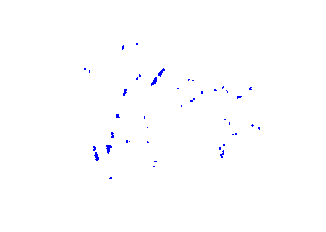

Population data wrangling with GBIF sampling event data
================
Prepared by Erlend B. Nilsen, <https://orcid.org/0000-0002-5119-8331>
20 juni 2018

1. Introduction to the use case
-------------------------------

The use case covered here is based on a data set published on gbif, containing inforamtion from a long-term line transect sampling survey targeting willow ptarmigan (*Lagopus lagopus*) in Norway. The data set originates from a line transect survey program in Finnmark county in northern Norway carried out from 2000- and onward. The surveys are part of a national program coordinated through the project Honsefuglportalen [(http://honsefugl.nina.no)](http://honsefugl.nina.no). The program is operated in close collaboration between the Norwegian Institute for Nature Research [(NINA; www.nina.no)](www.nina.no), Nord University [(www.nord.no)](www.nord.no), Inland Norway University of Applied Sciences [(www.inn.no)](www.inn.no) as well as landowners responsible for grouse management on their properties (FeFo, Statskog, Fjellstyrene as well as private landowners).

In general, NINA offers common e-infrastructure through the web-portal Honsefuglportalen <http://honsefugl.nina.no>, and NINA together with the involved universities are offering general guidance regarding and sampling design and provide common protocols for field procedures. The specific part of the program carried out in Finnmark is operated in collaboration between NINA and Finnmarkseiendommen (FeFo), with clear and distinct allocation of tasks and responsibilities between the parties. FeFo is responsible for conducting field work, as well as final decisions regarding allocation of transect lines among study areas.

Surveys are carried out mainly by volunteer personnel instructed to follow a common field protocols developed. Field work is carried out annually in August, with a team of two persons are following pre-defined transect lines, using trained pointing dogs to search both sides of the transect line. When birds are observed, cluster size (separated into age- and sex classes), perpendicular distances from the transect line to the observed cluster of birds, GPS coordinates and time of day is recorded. In addition, length (and position) of the transect line is recorded, as well as some other auxillary data.

------------------------------------------------------------------------

------------------------------------------------------------------------

2. Getting prepared: installing R-packages needed for this excersice
--------------------------------------------------------------------

Before we get started with the data set, we will install some packages that we will need to carry out the excersice detailed here. This is easily done by using the function `library`. If you do not allready have them installed , you will need to download them from CRAN. For this, you can use `install.packages("package name")`. Actually, you can put them all inside one function; `install.packages(c("package name1", "package name2"))`.

``` r
#############################################
## Loading some libraries -------------------
library(tidyverse)
library(sp)
library(rgeos)
library(geosphere)
library(rgdal)
library(lme4)
library(AICcmodavg)
library(MuMIn)
library(geosphere)
library(Distance)
library(lubridate)
library(stringr)
library(gridExtra)
library(Distance)
library(knitr)
library(RJSONIO)
library(dplyr)
library(tidyr)
library(stringr)
library(xml2)

LongLat = CRS("+proj=longlat +ellps=WGS84 +datum=WGS84")
```

3 Accessing the data
--------------------

Now that we have the required packages installed we will access the data. One way to do so is to manually download the DwC zip file, and unpack it in you working folder. Downloading dwc-a data from the IPT is covered in detail elswhere, so here we simply repat the procedures. Alternatively, you can do this direcely from within R-Studio. To do so, follow the procedure outlined below. Note that this is a *workaround*, and that work is being done to include this into formal R-packages.

#### 3.1. Get endpoint URL (IPT version of the DwC-A)

Use the [jsonlite package](https://cran.r-project.org/web/packages/jsonlite/vignettes/json-apis.html) to get the endpoint for the raw DwC-a representation of the dataset at the IPT installation. This takes the raw call, downloads information as JSON. This address can also be found by scrolling down on the dataset homepage to the [data description section](https://www.gbif.org/dataset/c47f13c1-7427-45a0-9f12-237aad351040#registration)

``` r
datasetID <- "c47f13c1-7427-45a0-9f12-237aad351040"
dataset <- RJSONIO::fromJSON(paste0("http://api.gbif.org/v1/dataset/",datasetID,"/endpoint"))
endpoint_url <- dataset[[1]]$url # extracting URL from API call result
```

The endpoint URL will look like

-   <http://data.nina.no:8080/ipt/archive.do?r=line-transect_data_tetraonidae_fefo>

#### 3.2 Download

We then extract the DWC-A endpoint URL and download the DwC-A:

``` r
# Download from dwc-a from IPT  putting into data folder;
download.file(endpoint_url, destfile="data/temp.zip", mode="wb")
unzip ("data/temp.zip", exdir = "data")
```

------------------------------------------------------------------------

------------------------------------------------------------------------

#### 3.3 Resource citation

Following acceptable reuse of openly published data, we should cite the data and the data set to give credit to the data providers. One way to get to the citation string from within R is to follow the procedure bellow:

``` r
# Suggested citation: Take the citation as from downloaded from GBIF website, replace "via GBIF.org" by endpoint url. 
tmp <- tempfile()
download.file(paste0("http://api.gbif.org/v1/dataset/",datasetID,"/document"),tmp) # get medatadata from gbif api
meta <- read_xml(tmp) %>% as_list() # create list from xml schema
gbif_citation <- meta$additionalMetadata$metadata$gbif$citation[[1]] # extract citation
citation <- gsub("GBIF.org", paste(endpoint_url), gbif_citation) # replace "gbif.org" with endpoint url
```

The citation string will then be

-   Nilsen E B, Vang R, Asbjørnsen E (2018). Tetraonid line transect surveys from Norway: Data from Finnmarkseiendommen (FeFo). Version 1.2. Norwegian Institute for Nature Research. Sampling event dataset <https://doi.org/10.15468/s7c8qd> accessed via <http://data.nina.no:8080/ipt/archive.do?r=line-transect_data_tetraonidae_fefo> on 2018-06-21.

------------------------------------------------------------------------

------------------------------------------------------------------------

4 Reading the data into R - and some inital preparations
--------------------------------------------------------

Once the data set is downloaded unzip it can be loaded into your current R-session using e.g. `read.table` or `read.csv` to get the data into R.

``` r
d <- read.csv("data/event.txt", sep="\t", encoding = "UTF-8") %>% select(-id)  # Event table
Occ <- read.csv("data/occurrence.txt", sep="\t", stringsAsFactors = FALSE, encoding = "UTF-8") %>% select(-id)  # Occurence table
```

To make the data ready for analysis and exploration, we need to do some data wrangling. First, we add sampling year (eventYear) to the data table using the `year` function in library `lubridate`. We also use the function `colsplit` in library `reshape2` to split the line string in the column dynamicProperties.

``` r
####################################################################
### Adding eventYear; as given by the eventDate field--------------------
### Making sampleSizeValue numeric ---------------------------------

d <- d %>% mutate(eventYear=year(eventDate)) 

d$dynamicProperties <- gsub("}", '', d$dynamicProperties)
temp2 <- reshape2::colsplit(d$dynamicProperties, ":", c("temp1", "distanceToTransectLine"))
d <- mutate(d, distanceToTransectLine=temp2$distanceToTransectLine)
```

------------------------------------------------------------------------

------------------------------------------------------------------------

5 Inspecting effort data: how much effort is put into the data collection each year?
------------------------------------------------------------------------------------

Because these data are published using the event-core data model, the sampling effort (here - length of the line transects) are included in the data. In fact, the field *locationID* gives the unique identifier for each transect line (most of which are surveyd multiple years), and *sampleSizeValue* which will give the length of the transect line (given in meeter; *sampleSizeUnit*).

In this data set, an event can mean two different things: both the actual line transect survey (i.e. the process of taking the sample) as well as an observation along that transect survey. In addition, the field *eventRemarks* includes information about the type of event that is recorded in that particular row in the data table. Events of the former type can be recognized as "Line transect" in the *eventRemarks* field, whereas observations are recognized as *Human observation*. Thus, a simple filtering procedure can be used to distinguish between the two types of events (see example bellow).

First, we will just make a summary of the number of years each line has bee surveyd. As can be seen in the example below there is substantial variation in the number of years each transect has been surveyd.

``` r
########################################################
##### Number of years surveyd along each line ----------

LineData <- filter(d, eventRemarks=="Line transect")

N_years_line <- LineData %>% dplyr::count(locationID)
head(N_years_line)
```

    ## # A tibble: 6 x 2
    ##                             locationID     n
    ##                                 <fctr> <int>
    ## 1 00385EE2-FAE9-42EE-B0CE-5F2FA8C6286A    12
    ## 2 01C99DD2-F45F-446E-A2D8-EB7CA4708299     5
    ## 3 01D9490F-43FA-4E56-92D4-D8DED20F4439    15
    ## 4 0328F60B-F365-4A8A-9B12-05A86E7E4CA4     2
    ## 5 033391FB-98D0-428C-B8DD-84C8C4619ACA     2
    ## 6 0336765E-AEF4-4108-916B-2C3899F5E364     2

By summarizing the effort data across years, we could also inspect how effort varies across years. Such information is crucial if we are to estimate temporal (or spatial) trends in abundance or site-occupancy. First, we summarize effort in terms of number of transect lines surveys each year, and then use the information in the *sampleSizeValue* field to estimate the total distance surveyd each year.

``` r
########################################################
##### Number of lines surveyd each year ---------------
N_lines_year <- LineData %>% dplyr::count(eventYear)

########################################################
##### Number of km surveyd each year ---------------
EffortData <- LineData %>% group_by(eventYear)
Effort <- dplyr::summarize(EffortData, Effort=sum(sampleSizeValue)/1000)
```

Making a simple plot of the variation in annual effort will make it more easy to see how effort varies across the years.

``` r
## plotted in Fig1 -------------------------------------
###########################################
#### FIG; Effort & number of lines ------

par(mfrow=c(2,1), bty="l", cex=1.1)

par(mar=c(1, 4, 3,1))
barplot(N_lines_year$n, names.arg=N_lines_year$eventYear, col="dark orange", xlab="", ylab="Number of transect lines")
text("A)", cex=1.2, x=2000, y=150)

par(mar=c(4, 4, 1,1))
plot(Effort$eventYear, Effort$Effort, type="b", ylim=c(0, 1000), lwd=2, pch=16, col="dark orange", xlab="Year", ylab="Effort (km)")
text("B)", cex=1.2, x=2000, y=800)
```


**Figure 1** *Summary of number of transect lines (A) and total combined length of line transects (B) survey each year in a line transect survey program used to monitor fluctuations in willow ptarmigan (Lagopus lagopus) population in Finnmark county, Norway.*

------------------------------------------------------------------------

------------------------------------------------------------------------

#### 6 Spatial locations of transect lines

As outlined above, the number of transect lines surveyd each year has varied through the study period. Thus, as a natural consequnce, a map illustrating the location of the survey lines will differ somewhat between years. Here, we will just disregard this point, and just have quick look at the location of transects that are surveyd at least once during the stud period.

The first thing we we do is to transform the footprintWKT-field, which contains inforamtion about the location of the transect lines, into a `SpatialLinesDataFrame` object. This can be used in using e.g. function `readWKT` in library `rgeos`. It might not be needed, but it is highly recomended to define the coordinate reference system (RCS): We define this in the beginning of the section bellow:

``` r
###############################################################################################

## DEFINING CRS -------------------------------------------------------------------------------
LongLat = CRS("+proj=longlat +ellps=WGS84 +datum=WGS84")

## SUBSETTING TRANSECT lines (locationID)------------------------------------------------------
## Making SpatialLinesDataFrame-object from footprintWKT; i.e. line coordinates ---------------

lines <- unique(d$locationID)


for (i in 1:length(lines)) {
  if (i == 1) {
    temp <- filter(d, locationID==lines[i] & footprintWKT != "NULL") 
    spTemp <- readWKT(temp$footprintWKT[1], temp$locationID[1], p4s=LongLat)
    
  }
  else {
    temp <- filter(d, locationID==lines[i] & footprintWKT != "NULL") 
    spTemp = rbind(
      spTemp, readWKT(temp$footprintWKT[1], temp$locationID[1], p4s=LongLat)
      
    )
  }
}


data <- as.data.frame(lines)
colnames(data) <- c("locationID")
rownames(data) <- paste(data$locationID)

Lines_transect <- SpatialLinesDataFrame(spTemp, data, match.ID=T)   
```

The resulting object *Lines\_transect* is an object of class `SpatialLinesDataFrame` that contains four sloths. Further manipulations and subsetting could of course be performed on this object, depending on the question the data user is persuing. Here, we do not follow up on that further.

------------------------------------------------------------------------

------------------------------------------------------------------------

Ok, so now we have a `SpatialLinesDataFrame`. A simple map showing the location of transect lines could be produced using the code bellow:

``` r
wrld <- map_data("world")
Nor <- subset(wrld, region=="Norway")
Lines_fortify <- fortify(Lines_transect, id="locationID")

x <- c(21.5, 32, 32, 21.5, 21.5)
y <- c(68, 68, 72, 72, 68)
id <- rep(1,5)
box <- data.frame(x,y, id)
fortify_box <- fortify(box, id="id")


p1 <- ggplot() + geom_polygon(data = Nor, aes(x=long, y = lat, group = group), fill="grey70", color="yellow") + 
  geom_path(data=fortify_box, aes(x=x, y=y), lwd=2, col="dark green")+
  coord_map(xlim=c(0, 35), ylim=c(55, 75))

p2 <- ggplot() + geom_polygon(data = Nor, aes(x=long, y = lat, group = group), fill="grey70", color="yellow") + 
  geom_path(data=Lines_fortify, aes(x=long, y=lat, group=group), lwd=3, col="red") +
  coord_map(xlim=c(21.5, 32), ylim=c(68, 71.5))

grid.arrange(p1, p2, ncol=2)
```


**Figure 2** *Map illustrating locations of transect lines used in a line transect survey program used to monitor fluctuations in willow ptarmigan (Lagopus lagopus) population in Finnmark county, Norway.*

------------------------------------------------------------------------

------------------------------------------------------------------------

#### 7 Setting up the occurence data - combining the event table and the occurence table

``` r
################################################################################################
#### Occurence data from event table ----------------------------------------------------------
#### Extracting only records where distance to transect line is reported by field crew --------

Occu <- filter(d, dynamicProperties!="NA")

###############################################################################################
##### Casting occurence data  - from Occurence table in wide format ---------------------------

Occ <- Occ %>% mutate(SexStage=str_c(sex, lifeStage, sep = "")) 

Occ_wide <- spread(Occ[c("eventID", "SexStage", "individualCount", "scientificName")], key="SexStage", value= "individualCount", fill=0)  
Occ_wide <- mutate(Occ_wide, clusterSize=rowSums(Occ_wide[c("FemaleAdult", "MaleAdult", "unknownJuvenile", "unknownunknown")], na.rm=T))


##############################################################################################
####### Joining with Occurence-events from events-table -------------------------------------

Occ_combined <- plyr::join(Occu, Occ_wide, "eventID")
```

------------------------------------------------------------------------

------------------------------------------------------------------------

#### 8 A simplyfied Distance Sampling example

One of the more common ways to estiamte abundace (or density, which is simly abundance divided by area) is to use the distance sampling method. There exist a rich litterature on distance sampling modelling, and we will not cover that here. We would also like to stress the fact that because there is considerable variation in the study design during the study period from 2000- and onwards. In a proper analysis of the temporal dynamics such variation should be accounted for in the model framework. This is however beyond the scope of this excercise.

In our analysis presented here, we will use functions from library `Distance`. Note that there are several other r-packages that might provide greater flexibility in the modelling, and that there has been made recent progress in distance sampling models for open populations using Bayesian inference with code written in the BUGS language.

``` r
#################################################################################################
#### Prepearing for distance sampling --------------------------------------------------------
#### Using functions in R add-on library "Distance" ------------------------------------------
#### We could use a "flatfile", but it is often convenient to supply the function ------------
#### with the following four data tables -----------------------------------------------------


## Focusing only on willow ptarmigan (Lagopus lagopus)
Occ_combined_Lagopus <- Occ_combined %>% filter(scientificName=="Lagopus lagopus" & distanceToTransectLine !="NA") 

## Region table ---------

Reg_dat <- data.frame(Region.Label=paste(sort(unique(LineData$eventYear))), Area=rep(1000, length(unique(LineData$eventYear)))) 

## Sample table ----------

Samp_dat <- data.frame(Sample.Label=LineData$eventID, Region.Label=paste(LineData$eventYear), Effort=LineData$sampleSizeValue/1000)


## Observation table -----

Obs_dat <- data.frame(object=as.numeric(Occ_combined_Lagopus$eventID), 
       Region.Label=paste(Occ_combined_Lagopus$eventYear), Sample.Label=Occ_combined_Lagopus$parentEventID)

## Data table ------------

Dat_tab <- data.frame(object=as.numeric(Occ_combined_Lagopus$eventID), distance=Occ_combined_Lagopus$distanceToTransectLine/1000, 
                               size=Occ_combined_Lagopus$clusterSize, Strata=paste(Occ_combined_Lagopus$eventYear))
```

Having set up the data tables above, we now turn to the actual Distance sampling analysis. The model outlined below is just one of many possible ways to model how the detection probability decrease as a function of distance to the transect line. In this particualar case, we assume that the detection probability is adaquately modelled using a half normal distribution modified with a polynomial adjustemet term, and that the scale parameter of the half normal distribution is affected by the cluster size. The model give an adequate fit to the data, but in a real world case different detection models might be compared e.g. using the AIC criterion.

``` r
########################################################
### Simple analysis - DistanceSampling -----------------
### Adviced to compare multiple detection models -------

ds.model <-ds(data=Dat_tab, region.table=Reg_dat, sample.table=Samp_dat, 
               obs.table=Obs_dat, adjustment="poly", order=2, transect="line", truncation="10%", 
               formula= ~size, key="hn")
```

Having fitted the model, we will typically assess goodness-of-fit using the `fit.test` function.

``` r
##########################################################################
##### FIG; Assessing goodness-of-fit and plotting detection models-------------

par(mfrow=c(1,2))
plot(ds.model, main="Detection model", pch=16, lwd=2)
fit.test <- ddf.gof(ds.model$ddf, lwd=2, pch=16)
```


------------------------------------------------------------------------

Based on this plot, as well as the goodness-of-fit test (not shown here), we go forward and inspect the resulting density estimates;

``` r
############################################
#### FIG; Density across years -----------
x <- ds.model$dht$individuals$D$Label[-length(ds.model$dht$individuals$D$Label)]
y <- ds.model$dht$individuals$D$Estimate[-length(ds.model$dht$individuals$D$Estimate)]

par(bty="l", cex=1.1, lwd=1.2)
plot(as.numeric(as.character(x)), y, type="b", pch=16, col="dark orange", ylim=c(0, 40), xlab="Year", ylab="Ptarmigan density")
```


**Figure** *Estimated mean density (ptarmigan pr. km-2) in the years 2000-2017 based on data from a line transect survey program used to monitor fluctuations in willow ptarmigan (Lagopus lagopus) population in Finnmark county, Norway. Data was published using the event-core data model of gbif. Note that the estimates reported here are from a simplified analysis that does not model the variation in spatial arrangement of transect lines across years. Estimates are used here for illustratative purposes only.*

9 Making occurence data in a `SpatialPointsDataFrame` object
------------------------------------------------------------

This step is not needed for further analysis, but could still be useful:

``` r
dat<- Occu %>% select (eventID, eventYear, municipality)
pts <- cbind(Occu$decimalLongitude, Occu$decimalLatitude)
obs_spatial <- SpatialPointsDataFrame(pts, dat, proj4string=LongLat)
plot(obs_spatial, col="blue",pch = 20, cex=0.1)
```



10 Estimating distance from transect lines based on coordintes
--------------------------------------------------------------

In the current data, the distance to the transect line is measured in the field by the field crew. However, they also report the gps postion of the occurence point. Sometimes these two measures do not match exactly. To do this, we use the function `dist2Line` from package `rgeos`.

``` r
##############################################################################
# MEASURE DISTANCE TO LINE####################################################


Ulid_1  <- Occu %>% filter(eventYear==2010 & municipality=="Kautokeino") 
Ulid <-  unique(Ulid_1$locationID)

res <- as.data.frame(matrix(ncol=29, nrow=0))

for(j in 1:length(Ulid)){
  
  i <- Ulid[j]
  
  temp_obs <- subset(Occu, locationID==i)
  
  temp_coords <- cbind(temp_obs$decimalLongitude, temp_obs$decimalLatitude)
  temp_p <- SpatialPoints(temp_coords, LongLat)
  
  temp_line <- Lines_transect[Lines_transect@data$locationID==i,]
  
  di <- dist2Line(temp_p, temp_line)
  
  temp_obs$N_dist <- di[,1]
  res <- rbind(res, temp_obs)
}
```

11 A simple leaflet map
-----------------------

In cases you want to inspect further your data, making use of e.g. the `leaflet` package can be useful. the example bellow is just a wokring example, but serves as an template for further work. The code is not evaluated here, but you can do so in your own RStudio session.

``` r
coord <- as.matrix(cbind(Occu$decimalLongitude, Occu$decimalLatitude))
tempo <- SpatialPoints(coord, proj4string=LongLat)


library(leaflet)
m <- leaflet() %>%
  addProviderTiles(providers$Esri.NatGeoWorldMap) %>%  # Add default OpenStreetMap map tiles
  addMarkers(data=tempo, clusterOptions = markerClusterOptions()) %>%
  addPolylines(data=Lines_transect, popup=paste("locationID", Lines_transect@data$locationID, sep=" ")) 
m  # Print the map
```
